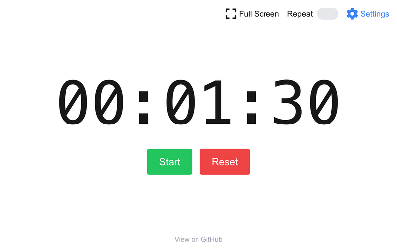

# YACT (Yet Another Countdown Timer)

YACT is a customizable countdown timer web application.  It allows
users to set timers with specific hours, minutes, and seconds, and
offers various settings to tailor the timer's behavior according to
individual preferences.

YACT has been inspired by Big Timer (an online service), but has been
developed as a free software, self-hosted alternative, built from
scratch with Next.js, React, and Tailwind CSS.

## Features

- Customizable Timer: Set hours, minutes, and seconds to create a
  timer that fits your needs.
- Two Modes: Choose between a fixed duration countdown or a target
  time mode that counts down to a specific clock time (e.g., 16:00:00).
- Repeat Functionality: Option to automatically repeat the timer when
  it reaches zero.
- Count Up After Timer Ends: Choose to have the timer count upwards
  after reaching zero.
- Sound Notifications:
  - Play a sound when the timer ends.
  - Play a ticking sound during each of the last 10 seconds.
- Responsive Design: Optimized for various screen sizes, including
  mobile devices.
- Fullscreen Mode: Toggle fullscreen view for an immersive experience.
- URL Parameters: Share or bookmark specific timer settings using URL
  parameters.
- Settings Persistence: User preferences are saved locally to maintain
  settings across sessions.

<picture>
  <source media="(prefers-color-scheme: dark)" srcset="./.screenshots/main-view-dark.png">
  <source media="(prefers-color-scheme: light)" srcset="./.screenshots/main-view-light.png">
  
</picture>

## Running

### Running with Docker (out of the box)

```shell
docker run -it -p 8080:8080 --name yact ghcr.io/wojciechpolak/yact
```

### Running with Docker Compose

```shell
curl https://raw.githubusercontent.com/wojciechpolak/yact/master/docker-compose.yml | docker compose -f - up
```

### Running from the source code

1. Clone the Repository

   ```shell
   git clone https://github.com/wojciechpolak/yact.git
   cd yact
   ```

2. Install Dependencies

   ```shell
   npm ci
   ```

3. Run the Application

   ```shell
   npm run dev
   ```

4. Open in Browser

Visit http://localhost:3000 to access the countdown timer.

## License

This project is licensed under the GNU General Public License v3.0.
See the [COPYING](COPYING) file for details.

### Icon Attribution

The icons used in this project are from the [OpenMoji](https://openmoji.org)
project and are licensed under the
[CC BY-SA 4.0](https://creativecommons.org/licenses/by-sa/4.0/) license.

### Audio Attribution

- Big Bell by Slothfully_So -- https://freesound.org/s/685065/ -- License: Creative Commons 0
- Clock Bonmark Tick by zmastafa102 -- https://freesound.org/s/509714/ -- License: Creative Commons 0
